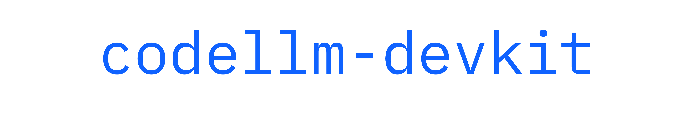

# CodeLLM-devkit: A Python library for seamless interaction with CodeLLMs

codellm-devkit provides unified language to get off-the-shelf static analysis for multiple programming languages  and support for applying those analyses for code LLM use cases.
