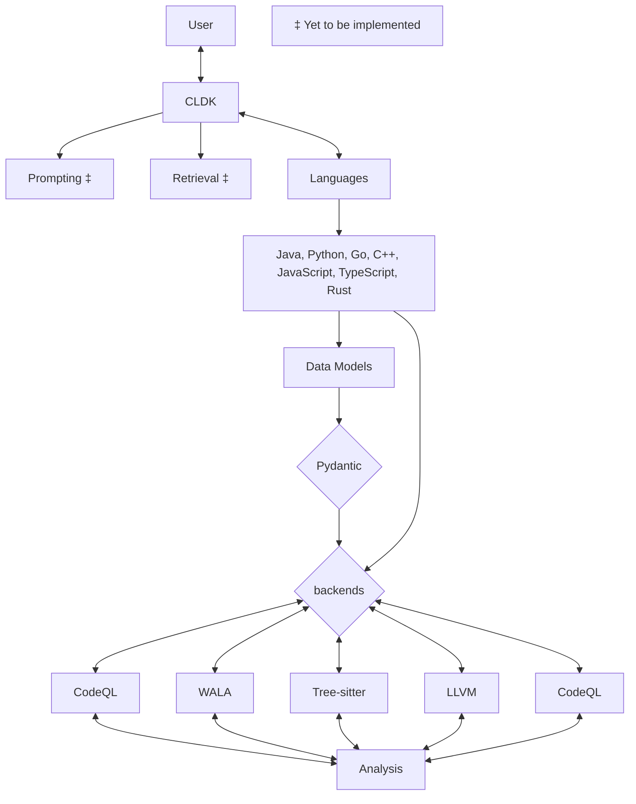

# CodeLLM-Devkit: A Python library for seamless interaction with CodeLLMs


[](https://www.python.org/downloads/release/python-3110/)

Codellm-devkit (CLDK) is a multilingual program analysis framework that bridges the gap between traditional static analysis tools and Large Language Models (LLMs) specialized for code (CodeLLMs). Codellm-devkit allows developers to streamline the process of transforming raw code into actionable insights by providing a unified interface for integrating outputs from various analysis tools and preparing them for effective use by CodeLLMs.

Codellm-devkit simplifies the complex process of analyzing codebases that span multiple programming languages, making it easier to extract meaningful insights and drive LLM-based code analysis. `CLDK` achieves this through an open-source Python library that abstracts the intricacies of program analysis and LLM interactions. With this library, developer can streamline the process of transforming raw code into actionable insights by providing a unified interface for integrating outputs from various analysis tools and preparing them for effective use by CodeLLMs.

**The purpose of Codellm-devkit is to enable the development and experimentation of robust analysis pipelines that harness the power of both traditional program analysis tools and CodeLLMs.**
By providing a consistent and extensible framework, Codellm-devkit aims to reduce the friction associated with multi-language code analysis and ensure compatibility across different analysis tools and LLM platforms.

Codellm-devkit is designed to integrate seamlessly with a variety of popular analysis tools, such as WALA, Tree-sitter, LLVM, and CodeQL, each implemented in different languages. Codellm-devkit acts as a crucial intermediary layer, enabling efficient and consistent communication between these tools and the CodeLLMs.

Codellm-devkit is constantly evolving to include new tools and frameworks, ensuring it remains a versatile solution for code analysis and LLM integration.

Codellm-devkit is:

- **Unified**: Provides a single framework for integrating multiple analysis tools and CodeLLMs, regardless of the programming languages involved.
- **Extensible**: Designed to support new analysis tools and LLM platforms, making it adaptable to the evolving landscape of code analysis.
- **Streamlined**: Simplifies the process of transforming raw code into structured, LLM-ready inputs, reducing the overhead typically associated with multi-language analysis.

Codellm-devkit is an ongoing project, developed at IBM Research.

## Contact

For any questions, feedback, or suggestions, please contact the authors:

| Name | Email |
| ---- | ----- |
| Rahul Krishna | [i.m.ralk@gmail.com](mailto:i.m.ralk@gmail.com) |
| Rangeet Pan | [rangeet.pan@ibm.com](mailto:rangeet.pan@gmail.com) |
| Saurabh Sihna | [sinhas@us.ibm.com](mailto:sinhas@us.ibm.com) |
## Table of Contents

- [CodeLLM-Devkit: A Python library for seamless interaction with CodeLLMs](#codellm-devkit-a-python-library-for-seamless-interaction-with-codellms)
  - [Contact](#contact)
  - [Table of Contents](#table-of-contents)
  - [Architectural and Design Overview](#architectural-and-design-overview)
  - [Quick Start: Example Walkthrough](#quick-start-example-walkthrough)
    - [Prerequisites](#prerequisites)
    - [Step 1:  Set up an Ollama server](#step-1--set-up-an-ollama-server)
      - [Pull the latest version of Granite 8b instruct model from ollama](#pull-the-latest-version-of-granite-8b-instruct-model-from-ollama)
    - [Step 2:  Install CLDK](#step-2--install-cldk)
    - [Step 3:  Build a code summarization pipeline](#step-3--build-a-code-summarization-pipeline)

## Architectural and Design Overview

Below is a very high-level overview of the architectural of CLDK:




The user interacts by invoking the CLDK API. The CLDK API is responsible for handling the user requests and delegating them to the appropriate language-specific modules. 

Each language comprises of two key components: data models and backends.

1. **Data Models:** These are high level abstractions that represent the various language constructs and componentes in a structured format using pydantic. This confers a high degree of flexibility and extensibility to the models as well as allowing for easy accees of various data components via a simple dot notation. In addition, the data models are designed to be easily serializable and deserializable, making it easy to store and retrieve data from various sources.


2. **Analysis Backends:** These are the components that are responsible for interfacing with the various program analysis tools. The core backends are Treesitter, Javaparse, WALA, LLVM, and CodeQL. The backends are responsible for handling the user requests and delegating them to the appropriate analysis tools. The analysis tools perfrom the requisite analysis and return the results to the user. The user merely calls one of several high-level API functions such as `get_method_body`, `get_method_signature`, `get_call_graph`, etc. and the backend takes care of the rest. 

    Some langugages may have multiple backends. For example, Java has WALA, Javaparser, Treesitter, and CodeQL backends. The user has freedom to choose the backend that best suits their needs. 

We are currently working on implementing the retrieval and prompting components. The retrieval component will be responsible for retrieving the relevant code snippets from the codebase for RAG usecases. The prompting component will be responsible for generating the prompts for the CodeLLMs using popular prompting frameworks such as `PDL`, `Guidance`, or `LMQL`.  


## Quick Start: Example Walkthrough

In this section, we will walk through a simple example to demonstrate how to use CLDK. We will:

* Set up a local ollama server to interact with CodeLLMs
* Build a simple code summarization pipeline for a Java and a Python application.

### Prerequisites

Before we begin, make sure you have the following prerequisites installed:

  * Python 3.11 or later
  * Ollama v0.3.4 or later


### Step 1:  Set up an Ollama server

If don't already have ollama, please download and install it from here: [Ollama](https://ollama.com/download). 

Once you have ollama, start the server and make sure it is running.

If you're on MacOS, Linux, or WSL, you can check to make sure the server is running by running the following command:

```bash
sudo systemctl status ollama
```

You should see an output similar to the following:

```bash
➜ sudo systemctl status ollama
● ollama.service - Ollama Service
     Loaded: loaded (/etc/systemd/system/ollama.service; enabled; preset: enabled)
     Active: active (running) since Sat 2024-08-10 20:39:56 EDT; 17s ago
   Main PID: 23069 (ollama)
      Tasks: 19 (limit: 76802)
     Memory: 1.2G (peak: 1.2G)
        CPU: 6.745s
     CGroup: /system.slice/ollama.service
             └─23069 /usr/local/bin/ollama serve
```

If not, you may have to start the server manually. You can do this by running the following command:

```bash
sudo systemctl start ollama
```

#### Pull the latest version of Granite 8b instruct model from ollama

To pull the latest version of the Granite 8b instruct model from ollama, run the following command:

```bash
ollama pull granite-code:8b-instruct
```

Check to make sure the model was successfully pulled by running the following command:

```bash
ollama run granite-code:8b-instruct 'Write a function to print hello world in python'
```

The output should be similar to the following:

```
➜ ollama run granite-code:8b-instruct 'Write a function to print hello world in python'

def say_hello():
    print("Hello World!")
```

### Step 2:  Install CLDK

You may install the latest version of CLDK from our GitHub repository:

```python
pip install git+https://github.com/IBM/codellm-devkit.git
```

Once CLDK is installed, you can import it into your Python code:

```python
from cldk import CLDK
```

### Step 3:  Build a code summarization pipeline

Now that we have set up the ollama server and installed CLDK, we can build a simple code summarization pipeline for a Java application.

1. Let's download a sample Java (apache-commons-cli):

    * Download and unzip the sample Java application:
        ```bash
        wget https://github.com/apache/commons-cli/archive/refs/tags/rel/commons-cli-1.7.0.zip -O commons-cli-1.7.0.zip && unzip commons-cli-1.7.0.zip
        ```
    * Record the path to the sample Java application:
        ```bash
        export JAVA_APP_PATH=/path/to/commons-cli-1.7.0 
      ```


Below is a simple code summarization pipeline for a Java application using CLDK. It does the following things:

* Creates a new instance of the CLDK class (see comment `# (1)`)
* Creates an analysis object over the Java application (see comment `# (2)`)
* Iterates over all the files in the project (see comment `# (3)`)
* Iterates over all the classes in the file (see comment `# (4)`)
* Iterates over all the methods in the class (see comment `# (5)`)
* Gets the code body of the method (see comment `# (6)`)
* Initializes the treesitter utils for the class file content (see comment `# (7)`)
* Sanitizes the class for analysis (see comment `# (8)`)
* Formats the instruction for the given focal method and class (see comment `# (9)`)
* Prompts the local model on Ollama (see comment `# (10)`)
* Prints the instruction and LLM output (see comment `# (11)`)

```python
# code_summarization_for_java.py

from cldk import CLDK


def format_inst(code, focal_method, focal_class):
    """
    Format the instruction for the given focal method and class.
    """
    inst = f"Question: Can you write a brief summary for the method `{focal_method}` in the class `{focal_class}` below?\n"

    inst += "\n"
    inst += f"```{language}\n"
    inst += code
    inst += "```" if code.endswith("\n") else "\n```"
    inst += "\n"
    return inst

def prompt_ollama(message: str, model_id: str = "granite-code:8b-instruct") -> str:
    """Prompt local model on Ollama"""
    response_object = ollama.generate(model=model_id, prompt=message)
    return response_object["response"]


if __name__ == "__main__":
    # (1) Create a new instance of the CLDK class
    cldk = CLDK(language="java")

    # (2) Create an analysis object over the java application
    analysis = cldk.analysis(project_path=os.getenv("JAVA_APP_PATH"))

    # (3) Iterate over all the files in the project
    for file_path, class_file in analysis.get_symbol_table().items():
        class_file_path = Path(file_path).absolute().resolve()
        # (4) Iterate over all the classes in the file
        for type_name, type_declaration in class_file.type_declarations.items():
            # (5) Iterate over all the methods in the class
            for method in type_declaration.callable_declarations.values():
                
                # (6) Get code body of the method
                code_body = class_file_path.read_text()
                
                # (7) Initialize the treesitter utils for the class file content
                tree_sitter_utils = cldk.tree_sitter_utils(source_code=code_body)
                
                # (8) Sanitize the class for analysis
                sanitized_class = tree_sitter_utils.sanitize_focal_class(method.declaration)

                # (9) Format the instruction for the given focal method and class
                instruction = format_inst(
                    code=sanitized_class,
                    focal_method=method.declaration,
                    focal_class=type_name,
                )

                # (10) Prompt the local model on Ollama
                llm_output = prompt_ollama(
                    message=instruction,
                    model_id="granite-code:20b-instruct",
                )

                # (11) Print the instruction and LLM output
                print(f"Instruction:\n{instruction}")
                print(f"LLM Output:\n{llm_output}")
```