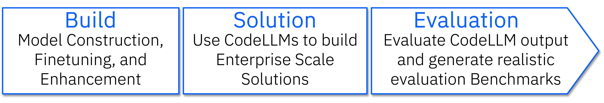

## Simplify your Code LLM solutions using CodeLLM Dev Kit (CLDK)

<!-- TODOs: 

Example: Raju

Experience: Rangeet, before and after

Nice picture: Rahul -->

### Introduction
Introduction:

As our team at IBM Research started to build a solution for application modernization based on Code Large Language Model (CodeLLM), we were faced with the abundance of multiple static analysis tooling to use coupled with core CodeLLM capabilities. These static analysis tools, such as Treesitter [], WALA [], etc., each range in their support for different programming language and its coverage of programming language features. Developers require a deep understanding of program analysis tooling and what they offer for each programming language, to create meaningful context/prompt augmentations when developing CodeLLM solutions. This in turn becomes a tedious task, and often requires multiple lines of code to be written to support various CodeLLM enabled tasks such as, generating unit tests, summarizing code, etc.  As a result, we have developed CodeLLM Development Kit (CLDK), which abstracts the interaction with the static analysis tools and enables seamless integration with CodeLLMs. 


CLDK finds its use in different aspects of CodeLLM lifecycle. It can help augment and enable generation of instruct datasets to enhance the existing models, it can be used to support evaluation of the models, and last but not least simplify development of enterprise use cases. 

[ Image of the abstraction / layers here from CLDK presentation]



CLDK currently support Java and Python analysis having Treesitter and WALA for static analysis tools. In the above figure, we show the current support and the future roadmap of CLDK.

How to use CLDK in practice:

Using CLDK is very simple. All you have to do is running the below command.

```
pip install git+https://github.com/IBM/codellm-devkit.git
```

To understand the potentiality of CLDK, let’s walkthrough an example of using CodeLLM and static analysis--generating junit test cases using CodeLLM.

Let’s consider a few examples from the enterprise setting and how CLDK can help: 

Examples:

Code summarization

Code testing

Code translation

Link to granite

Crosslink to AI Alliance

Link to GitHub

We have just started this journey - join our community. (granite adoption community)

We started with support for Java and Python with symbol table and call-graph support. Our immediate next step includes increasing the support in multiple directions — (a) more programming languages, such as C, C++, JavaScript, Go, Rust, etc., (b) deeper analysis by enabling call-graph analysis for more languages, and eventually support another analysis level for all the programming languages, (c) support prompt template generation languages, such as LMQL, Guidance, etc., and (d) enable more features like more APIs targeted towards post-processing of the LLM-based code generation, enabling RAG, and other LLM-based use cases.

Add High level overview of the roadmap (without commitment) - we started with support for following languages…