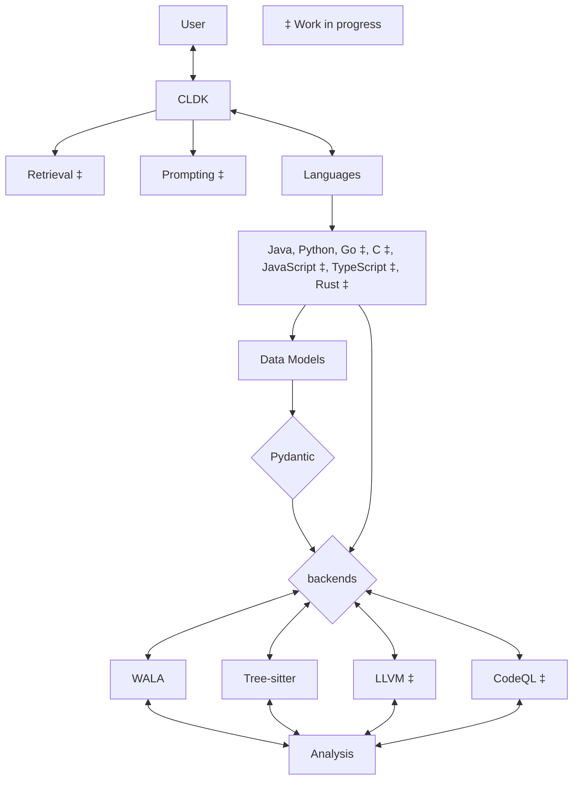

# CodeLLM-Devkit

[](https://www.python.org/downloads/release/python-3110/)

Codellm-devkit (CLDK) is a multilingual program analysis framework that bridges the gap between traditional static analysis tools and Large Language Models (LLMs) specialized for code (CodeLLMs). It allows developers to streamline the process of transforming raw code into actionable insights by providing a unified interface for integrating outputs from various analysis tools and preparing them for effective use by CodeLLMs.

## Key Features

- **Unified**: Provides a single framework for integrating multiple analysis tools and CodeLLMs, regardless of the programming languages involved.
- **Extensible**: Designed to support new analysis tools and LLM platforms, making it adaptable to the evolving landscape of code analysis.
- **Streamlined**: Simplifies the process of transforming raw code into structured, LLM-ready inputs, reducing the overhead typically associated with multi-language analysis.

## Installation

```bash
pip install git+https://github.com/IBM/codellm-devkit.git
```

For a detailed walkthrough on setting up and using CodeLLM-Devkit, check out our [Quick Start Guide](quick-start.md).

## Architecture



For more details on the architecture and design, see our [Architecture Overview](architecture.md).

## Contact

For questions, feedback, or suggestions, please contact the authors:

| Name | Email |
|------|-------|
| Rahul Krishna | [i.m.ralk@gmail.com](mailto:i.m.ralk@gmail.com) |
| Rangeet Pan | [rangeet.pan@ibm.com](mailto:rangeet.pan@gmail.com) |
| Saurabh Sihna | [sinhas@us.ibm.com](mailto:sinhas@us.ibm.com) |

## License

This project is developed at IBM Research. Please check the [LICENSE](./LICENSE.txt) file for more details.